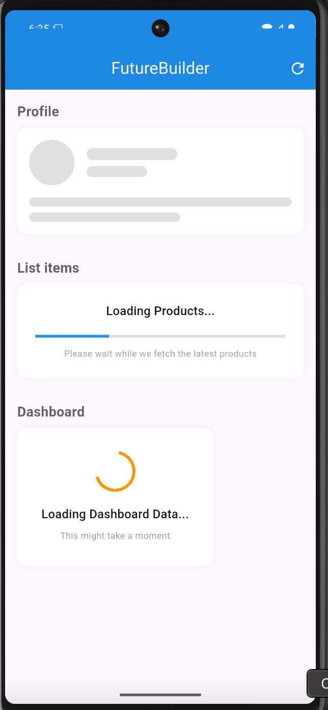
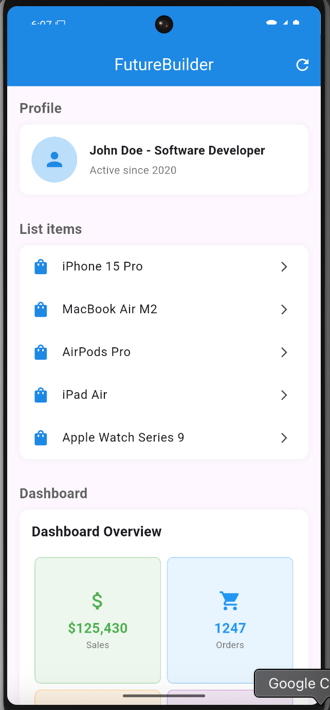

# FutureBuilder Demo

A Flutter app demonstrating FutureBuilder to load profile, product, and dashboard data with custom loaders.

## Screenshot

### Loading State

### Final UI

## How to Run

1. Make sure you have [Flutter](https://flutter.dev/docs/get-started/install) installed.
2. Clone this repository.
3. Run `flutter pub get` to fetch dependencies.
4. Run `flutter run` to launch the app on your device or emulator.

## Features / Attributes

- **Profile:** Shows a user profile card with a skeleton loader while loading.
- **List items:** Displays a list of products with a linear progress indicator during loading.
- **Dashboard:** Presents a dashboard overview with a spinner loader and summary cards for sales, orders, customers, and revenue.

---

This project demonstrates best practices for asynchronous data loading and custom loading indicators in Flutter.
